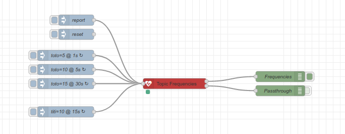

# Topic Frequencies

Computes frequencies of events per topic on a sliding interval.

This node is inspired by [node-red-contrib-metric-per-topic](https://flows.nodered.org/node/node-red-contrib-metric-per-topic)

## Documentation

Key features:

- Passthrough node, capturing metrics and let original message pass through
- Interval is sliding time window, allowing to report anytime and always have full *interval* data metrics
- Ability to specify *topic key* and *value key* measured, as JSON dot path (e.g. *payload.uniqueid*)
- Ability to specify *report* scheduler, distinct from *interval* used to measure frequencies
- Ability to *control* few operations, like *reset* counters, which can be triggered by Input node



## Testing

The repo comes with simple Docker environment for testing.

Build:

    $ docker-compose build

Start:

    $ docker-compose up -d

Browse to [http://localhost:2880](http://localhost:2880)

Edit Flow and check debug window on the right for metric messages

Stop:

    $ docker-compose down

Sample output:

```javascript
{
    "topics": {
        "toto": {
            "sum": 450,
            "avg": 6.081081081081081,
            "min": 5,
            "max": 15,
            "elements": 74
        },
        "titi": {
            "sum": 40,
            "avg": 10,
            "min": 10,
            "max": 10,
            "elements": 4
        },
        "<all>": {
            "sum": 490,
            "avg": 6.282051282051282,
            "min": 5,
            "max": 15,
            "elements": 78
        }
    },
    "cycles": 2476,
    "interval": 1,
    "units": "minutes",
    "topicKey": "payload.uniqueid",
    "valueKey": "payload.temp",
    "alignToClock": true,
    "_msgid": "b1bb6c79.43cb4"
}
```